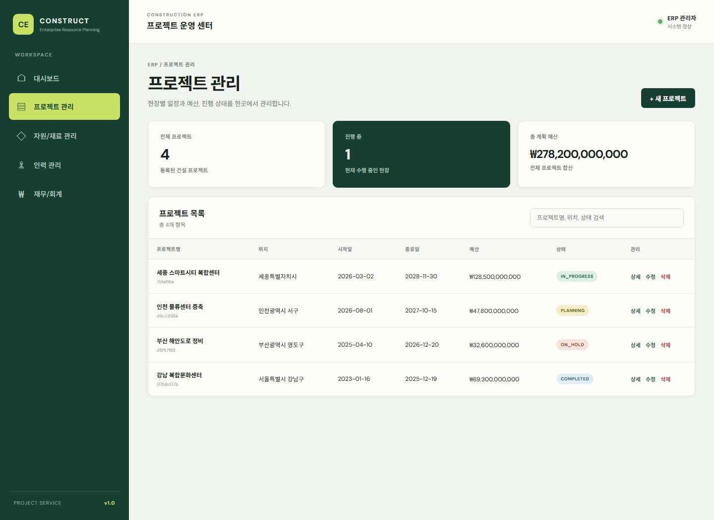
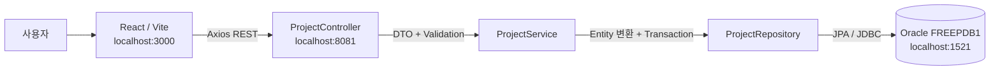

# Construction ERP

건설 프로젝트와 전사 업무 흐름을 학습하기 위한 풀스택 ERP 프로젝트입니다. 프로젝트 관리 도메인은 React 화면부터 Spring Boot REST API와 Oracle Database까지 연결되어 있으며, 나머지 전사 업무 모듈은 실제 ERP와 유사한 화면 흐름을 먼저 구현한 상태입니다.

## 화면 미리보기

### 프로젝트 관리



### 새로 추가된 전사 업무 화면

프런트엔드는 통합 대시보드와 13개 업무 모듈을 제공합니다.

| 구분 | 화면 | 주요 기능 | URL |
| --- | --- | --- | --- |
| Overview | 통합 대시보드 | 프로젝트·수주·집행·현장 인원 KPI, 공정률, 처리 업무 | `/dashboard` |
| Overview | 프로젝트 관리 | 목록, 상세, 등록, 수정, 삭제, Oracle CRUD 연동 | `/projects` |
| Business | 경영 | 경영계획, 실적분석, KPI, 보고서 | `/erp/management` |
| Business | 영업 | 영업기회, 견적, 계약, 수주현황 | `/erp/sales` |
| Business | 공사 | 현장, 공정, 실행예산, 기성, 작업일보 | `/erp/construction` |
| Business | 외주 | 협력업체, 외주계약, 외주기성, 업체평가 | `/erp/subcontract` |
| Business | 자재 | 품목, 자재요청, 발주, 입고, 재고 | `/erp/material` |
| People | 인사 | 사원, 조직, 인사발령, 근태 | `/erp/hr` |
| People | 노무 | 근로자, 출력현황, 노무비, 전자카드 | `/erp/labor` |
| People | 연말정산 | 대상자, 공제자료, 정산결과, 지급명세서 | `/erp/yearEnd` |
| People | 안전보건 | 안전점검, 위험성평가, 교육, 사고관리 | `/erp/safety` |
| Finance | 회계 | 전표, 계정별 원장, 월결산, 부가세 | `/erp/accounting` |
| Finance | 자금 | 자금일보, 지급요청, 계좌, 자금계획 | `/erp/treasury` |
| Finance | 경비 | 법인카드, 개인경비, 출장, 경비정산 | `/erp/expense` |
| System | 공통 | 공통코드, 거래처, 권한, 메뉴, 시스템 설정 | `/erp/common` |

각 ERP 업무 화면은 `업무 탭 → 핵심 지표 → 조회 조건 → 목록 Grid → 등록/수정 드로어`의 공통 흐름을 사용합니다. 기간·현장·키워드 검색과 브라우저 내 등록·수정·삭제가 동작하며 반응형 레이아웃을 지원합니다.

> 현재 Project 모듈만 Spring Boot와 Oracle에 연결됩니다. 나머지 13개 업무 모듈의 예시 데이터와 변경사항은 브라우저 메모리에만 유지되며 새로고침하면 초기화됩니다.

## 기술 스택

| 영역 | 기술 |
| --- | --- |
| Frontend | React 18, Vite 8, React Router 6, Axios, CSS |
| Backend | Java 17, Spring Boot 3.3, Spring MVC, Validation, Spring Data JPA |
| Database | Oracle AI Database Free, Oracle JDBC 17, Hibernate Oracle Dialect |
| API 문서 | Springdoc OpenAPI, Swagger UI |
| Build | Maven, npm |

## 시스템 구조



```text
React Page
  → Axios Client
  → ProjectController
  → ProjectService
  → ProjectRepository
  → Oracle PROJECTS Table
```

Entity를 Controller에서 직접 반환하지 않고 DTO로 변환하며, 입력값은 Jakarta Validation으로 검증합니다. 생성·수정 시각은 JPA 생명주기 애너테이션으로 관리합니다.

## 프로젝트 구조

```text
e-study/
├─ project-service/                    # Spring Boot Project API
│  ├─ pom.xml
│  └─ src/main/
│     ├─ java/com/constructionerp/project/
│     │  ├─ controller/
│     │  ├─ dto/
│     │  ├─ entity/
│     │  ├─ exception/
│     │  ├─ repository/
│     │  └─ service/
│     └─ resources/
│        ├─ application.yml
│        └─ schema.sql
├─ construction-erp-frontend/          # React ERP 관리자 화면
│  └─ src/
│     ├─ api/
│     ├─ components/
│     ├─ data/erpModules.js
│     └─ pages/
└─ docs/images/                        # README 화면 이미지
```

## 사전 준비

- Java 17
- Maven 3.9 이상
- Node.js 20 이상 및 npm
- Oracle AI Database Free
- 선택 사항: Oracle SQL Developer

```powershell
java -version
mvn -version
node --version
npm --version
```

## 1. Oracle Database 준비

### 1-1. Oracle AI Database Free 설치

Windows x64용 Oracle AI Database Free를 설치합니다.

- Oracle Database Free: https://www.oracle.com/database/free/
- Oracle SQL Developer: https://www.oracle.com/database/sqldeveloper/technologies/download/

| 항목 | 값 |
| --- | --- |
| Host | `localhost` |
| Port | `1521` |
| Container Database | `FREE` |
| Pluggable Database Service | `FREEPDB1` |
| 관리자 사용자 | `SYSTEM` 또는 `SYS` |

애플리케이션은 Container Database가 아닌 기본 PDB 서비스 `FREEPDB1`에 연결합니다.

### 1-2. Oracle 실행 확인

```powershell
Get-Service *Oracle*
Test-NetConnection localhost -Port 1521
```

`TcpTestSucceeded : True`이면 Listener에 접근할 수 있습니다. SQL*Plus가 설치되어 있다면 다음 명령으로도 확인할 수 있습니다.

```powershell
sqlplus system@localhost:1521/FREEPDB1
```

### 1-3. SQL Developer 연결

```text
Name         : Oracle Free Admin
Username     : SYSTEM
Password     : Oracle 설치 시 설정한 관리자 비밀번호
Hostname     : localhost
Port         : 1521
Connection   : Service name
Service name : FREEPDB1
```

`Test` 결과가 `Success`인지 확인한 후 접속합니다.

### 1-4. 애플리케이션 사용자 생성

`SYSTEM@FREEPDB1` 연결의 SQL Worksheet에서 다음 SQL을 실행합니다. 예시 비밀번호는 반드시 변경합니다.

```sql
CREATE USER construction_erp_app
IDENTIFIED BY "ChangeThis_StrongPassword1!";

GRANT CREATE SESSION, CREATE TABLE TO construction_erp_app;

ALTER USER construction_erp_app
QUOTA UNLIMITED ON USERS;
```

이미 사용자가 존재한다면 생성문 대신 비밀번호만 변경할 수 있습니다.

```sql
ALTER USER construction_erp_app
IDENTIFIED BY "ChangeThis_StrongPassword1!";
```

백엔드 시작 시 [`schema.sql`](project-service/src/main/resources/schema.sql)이 실행됩니다. 현재 사용자 스키마에 `PROJECTS` 테이블이 없을 때만 Oracle PL/SQL 블록으로 테이블을 생성합니다.

| Java | Oracle |
| --- | --- |
| `UUID` | `RAW(16)` |
| `String description` | `CLOB` |
| `LocalDate` | `DATE` |
| `LocalDateTime` | `TIMESTAMP` |
| `BigDecimal` | `NUMBER(15, 2)` |

## 2. 백엔드 실행

새 PowerShell에서 다음 명령을 실행합니다.

```powershell
cd C:\Users\82104\Desktop\codex\e-study\project-service

$env:DB_USERNAME="construction_erp_app"
$env:DB_PASSWORD="ChangeThis_StrongPassword1!"
$env:DB_URL="jdbc:oracle:thin:@//localhost:1521/FREEPDB1"

mvn clean compile
mvn spring-boot:run
```

환경변수는 현재 PowerShell 세션에만 적용되며 실제 비밀번호를 코드나 Git에 저장하지 않습니다.

| 서비스 | URL |
| --- | --- |
| Project API | http://localhost:8081/api/projects |
| Swagger UI | http://localhost:8081/swagger-ui.html |
| OpenAPI JSON | http://localhost:8081/v3/api-docs |

정상 실행 확인:

```powershell
Invoke-RestMethod http://localhost:8081/api/projects
```

프로젝트 생성 예시:

```powershell
$body = @{
  name = "세종 스마트시티 복합센터"
  description = "ERP 연동 확인용 프로젝트"
  location = "세종특별자치시"
  startDate = "2026-09-01"
  endDate = "2028-12-31"
  budget = 128500000000
  status = "PLANNING"
  projectManagerId = $null
} | ConvertTo-Json

Invoke-RestMethod `
  -Method Post `
  -Uri http://localhost:8081/api/projects `
  -ContentType "application/json" `
  -Body $body
```

## 3. 프런트엔드 실행

백엔드를 실행한 상태에서 별도 PowerShell을 엽니다.

```powershell
cd C:\Users\82104\Desktop\codex\e-study\construction-erp-frontend
npm install
npm run dev
```

브라우저에서 http://localhost:3000 에 접속합니다. 기본 진입 화면은 통합 대시보드입니다.

백엔드 주소를 변경하려면 환경 파일을 생성합니다.

```powershell
Copy-Item .env.example .env
```

```dotenv
VITE_API_BASE_URL=http://localhost:8081/api
```

환경변수를 변경한 후에는 Vite 개발 서버를 다시 시작해야 합니다.

## 전체 실행 순서

```text
1. Oracle Database 및 Listener 실행
2. FREEPDB1에 construction_erp_app 사용자 생성
3. 백엔드 환경변수 설정
4. mvn spring-boot:run
5. GET /api/projects 응답 확인
6. 별도 터미널에서 npm run dev
7. http://localhost:3000 접속
8. 프로젝트 등록 후 목록 및 Oracle PROJECTS 테이블 확인
```

SQL Developer에서 저장 결과를 확인합니다.

```sql
SELECT
    RAWTOHEX(ID) AS ID,
    NAME,
    LOCATION,
    STATUS,
    BUDGET,
    CREATEDAT,
    UPDATEDAT
FROM PROJECTS
ORDER BY CREATEDAT DESC;
```

## Project REST API

| Method | Endpoint | 설명 | 성공 응답 |
| --- | --- | --- | --- |
| `GET` | `/api/projects` | 전체 프로젝트 조회 | `200 OK` |
| `GET` | `/api/projects/{id}` | 프로젝트 상세 조회 | `200 OK` |
| `POST` | `/api/projects` | 프로젝트 생성 | `201 Created` |
| `PUT` | `/api/projects/{id}` | 프로젝트 수정 | `200 OK` |
| `DELETE` | `/api/projects/{id}` | 프로젝트 삭제 | `204 No Content` |

프런트엔드 `localhost:3000`은 백엔드 CORS 허용 주소에 포함되어 있습니다.

## 빌드 검증

```powershell
cd project-service
mvn clean compile

cd ..\construction-erp-frontend
npm install
npm run build
```

## 문제 해결

### `ORA-12541: TNS:no listener`

- Oracle 서비스가 실행 중인지 확인합니다.
- `Test-NetConnection localhost -Port 1521`을 실행합니다.
- JDBC URL의 포트가 실제 Listener 포트와 같은지 확인합니다.

### `ORA-12514` 또는 `ORA-12505`

- SID가 아니라 서비스 이름 `FREEPDB1`을 사용했는지 확인합니다.
- JDBC URL이 `jdbc:oracle:thin:@//localhost:1521/FREEPDB1` 형식인지 확인합니다.

### `ORA-01017: invalid username/password`

- `DB_USERNAME`, `DB_PASSWORD`를 다시 설정합니다.
- 사용자를 `FREEPDB1`에 생성했는지 확인합니다.
- Oracle 비밀번호는 대소문자를 구분합니다.

### `ORA-01950: no privileges on tablespace USERS`

```sql
ALTER USER construction_erp_app QUOTA UNLIMITED ON USERS;
```

### 프런트엔드에서 서버 연결 오류 표시

- 백엔드가 `8081` 포트에서 실행 중인지 확인합니다.
- http://localhost:8081/api/projects 를 직접 호출합니다.
- `.env`의 `VITE_API_BASE_URL`을 확인하고 Vite를 재시작합니다.

## 구현 상태와 다음 단계

### 완료

- Oracle 기반 Project Entity 및 스키마
- Project CRUD API와 DTO Validation
- 전역 예외 처리 및 Swagger 문서
- React 프로젝트 목록·상세·등록·수정·삭제
- 통합 대시보드와 ERP 13개 업무 모듈 화면
- 공통 조회 Grid와 등록·수정·삭제 UI
- 반응형 사이드바와 업무별 라우팅

### 다음 단계

- 자재·공사·외주 모듈 Spring Boot 서비스 분리
- 각 도메인 Oracle 테이블과 API 구현
- 페이징, 정렬 및 복합 검색
- 사용자 인증과 역할 기반 권한
- 승인 Workflow와 변경 이력
- Flyway 또는 Liquibase 기반 스키마 버전 관리
- 낙관적 잠금과 동시 수정 처리
- 자동화 테스트 및 CI

## 학습 목적

이 저장소는 건설 ERP의 일반적인 업무 구조와 Java 웹 애플리케이션의 계층 흐름을 학습하기 위한 프로젝트입니다. 특정 회사의 소스 코드, 데이터베이스 객체 또는 레거시 구현을 복제하지 않습니다.
